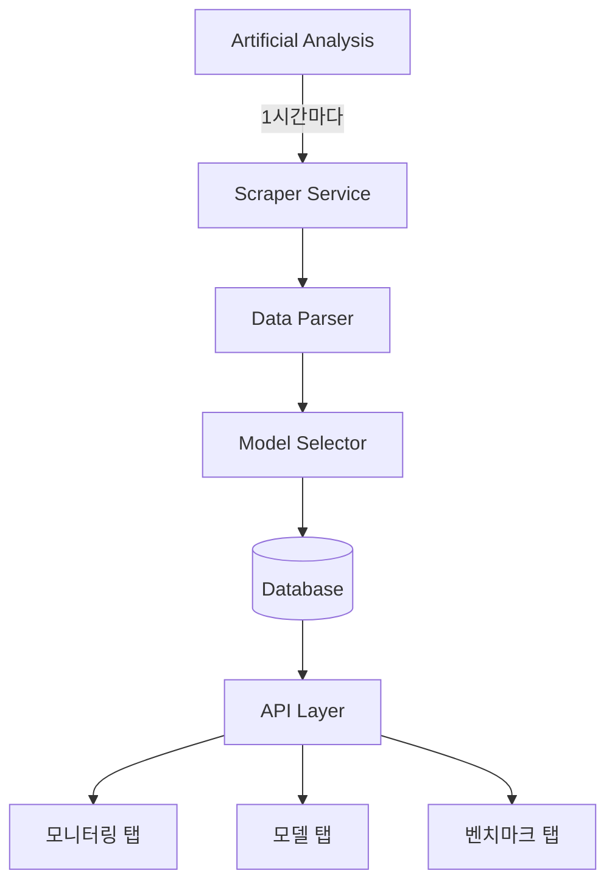

# 🔄 Artificial Analysis 실시간 통합 시스템 설계

## 📋 개요
Artificial Analysis를 1시간마다 스크래핑하여 모델 데이터를 자동으로 수집하고, 현재 UI에 실시간으로 반영하는 동적 모니터링 시스템 설계입니다.

**핵심 원칙**:
- ✅ 현재 UI 완전 유지
- ✅ 1시간 단위 자동 업데이트
- ✅ 동적 모델 선택 및 표시
- ✅ 모든 탭에 실시간 반영

---

## 🏗️ 시스템 아키텍처

### 전체 구조


---

## 🤖 핵심 컴포넌트 설계

### 1. **Artificial Analysis Scraper Service**

```typescript
// src/services/artificial-analysis-scraper.service.ts

import { chromium, Browser, Page } from 'playwright';
import cron from 'node-cron';

export class ArtificialAnalysisScraper {
  private browser: Browser | null = null;
  private modelCache: Map<string, any> = new Map();
  
  constructor() {
    // 1시간마다 실행 (매시 정각)
    cron.schedule('0 * * * *', () => {
      this.scrapeAndUpdate();
    });
    
    // 서버 시작 시 즉시 실행
    this.scrapeAndUpdate();
  }
  
  async scrapeAndUpdate() {
    console.log('🔄 Starting Artificial Analysis scraping...');
    
    try {
      // 1. 브라우저 초기화
      this.browser = await chromium.launch({ 
        headless: true,
        args: ['--no-sandbox', '--disable-setuid-sandbox']
      });
      
      const page = await this.browser.newPage();
      
      // 2. Artificial Analysis 접속
      await page.goto('https://artificialanalysis.ai/models', {
        waitUntil: 'networkidle',
        timeout: 30000
      });
      
      // 3. 모델 데이터 추출
      const models = await this.extractModels(page);
      
      // 4. 모델 선택 로직 적용
      const selectedModels = await this.selectModels(models);
      
      // 5. 데이터베이스 업데이트
      await this.updateDatabase(selectedModels);
      
      // 6. 캐시 갱신
      this.updateCache(selectedModels);
      
      console.log(`✅ Successfully scraped ${selectedModels.length} models`);
      
    } catch (error) {
      console.error('❌ Scraping failed:', error);
      // 폴백: 캐시된 데이터 사용
      await this.useCachedData();
    } finally {
      if (this.browser) {
        await this.browser.close();
      }
    }
  }
  
  private async extractModels(page: Page) {
    // 모델 데이터 추출 로직
    const models = await page.evaluate(() => {
      const modelElements = document.querySelectorAll('[data-model]');
      const extractedModels = [];
      
      modelElements.forEach(element => {
        const model = {
          name: element.querySelector('.model-name')?.textContent,
          provider: element.querySelector('.provider')?.textContent,
          intelligenceScore: parseFloat(
            element.querySelector('.intelligence')?.textContent || '0'
          ),
          outputSpeed: parseFloat(
            element.querySelector('.speed')?.textContent || '0'
          ),
          price: {
            input: parseFloat(
              element.querySelector('.price-input')?.textContent || '0'
            ),
            output: parseFloat(
              element.querySelector('.price-output')?.textContent || '0'
            )
          },
          contextWindow: parseInt(
            element.querySelector('.context')?.textContent || '0'
          ),
          lastUpdated: new Date().toISOString()
        };
        
        if (model.name && model.provider) {
          extractedModels.push(model);
        }
      });
      
      return extractedModels;
    });
    
    return models;
  }
}
```

### 2. **Dynamic Model Selector**

```typescript
// src/services/model-selector.service.ts

interface SelectionCriteria {
  minIntelligence?: number;
  maxModels?: number;
  requiredProviders?: string[];
  categories?: string[];
  priceLimit?: number;
}

export class ModelSelector {
  private readonly DEFAULT_CRITERIA: SelectionCriteria = {
    minIntelligence: 60,      // Intelligence Score 60 이상
    maxModels: 30,            // 최대 30개 모델
    requiredProviders: [      // 필수 포함 제공자
      'OpenAI',
      'Anthropic', 
      'Google',
      'Meta'
    ],
    categories: [
      'flagship',       // 주력 모델
      'cost-effective', // 가성비 모델
      'open-source',    // 오픈소스
      'specialized'     // 특화 모델
    ]
  };
  
  async selectModels(allModels: any[], criteria?: SelectionCriteria) {
    const config = { ...this.DEFAULT_CRITERIA, ...criteria };
    let selected = [];
    
    // 1. 필수 제공자의 최고 성능 모델 선택
    for (const provider of config.requiredProviders!) {
      const providerModels = allModels
        .filter(m => m.provider === provider)
        .sort((a, b) => b.intelligenceScore - a.intelligenceScore)
        .slice(0, 3); // 제공자당 상위 3개
      
      selected.push(...providerModels);
    }
    
    // 2. Intelligence Score 기준 상위 모델 추가
    const highPerformers = allModels
      .filter(m => 
        m.intelligenceScore >= config.minIntelligence! &&
        !selected.find(s => s.name === m.name)
      )
      .sort((a, b) => b.intelligenceScore - a.intelligenceScore)
      .slice(0, 10);
    
    selected.push(...highPerformers);
    
    // 3. 가성비 모델 추가 (성능/가격 비율)
    const costEffective = allModels
      .map(m => ({
        ...m,
        valueScore: m.intelligenceScore / (m.price.input + 0.01)
      }))
      .filter(m => !selected.find(s => s.name === m.name))
      .sort((a, b) => b.valueScore - a.valueScore)
      .slice(0, 5);
    
    selected.push(...costEffective);
    
    // 4. 최대 개수 제한
    selected = selected.slice(0, config.maxModels!);
    
    // 5. 메타데이터 추가
    return selected.map((model, index) => ({
      ...model,
      rank: index + 1,
      category: this.categorizeModel(model),
      isNew: !this.previousModels.has(model.name),
      trend: this.calculateTrend(model)
    }));
  }
  
  private categorizeModel(model: any): string {
    if (model.intelligenceScore > 75) return 'flagship';
    if (model.valueScore > 100) return 'cost-effective';
    if (model.isOpenSource) return 'open-source';
    return 'specialized';
  }
  
  private calculateTrend(model: any): 'rising' | 'stable' | 'falling' {
    // 이전 데이터와 비교하여 트렌드 계산
    const previous = this.previousModels.get(model.name);
    if (!previous) return 'rising'; // 새 모델
    
    const scoreDiff = model.intelligenceScore - previous.intelligenceScore;
    if (scoreDiff > 1) return 'rising';
    if (scoreDiff < -1) return 'falling';
    return 'stable';
  }
}
```

### 3. **Database Auto-Sync Strategy**

```typescript
// src/services/database-sync.service.ts

export class DatabaseSyncService {
  async syncModels(selectedModels: any[]) {
    const transaction = await prisma.$transaction(async (tx) => {
      // 1. 모든 모델을 inactive로 설정
      await tx.model.updateMany({
        where: { isActive: true },
        data: { isActive: false }
      });
      
      // 2. 선택된 모델 upsert
      for (const model of selectedModels) {
        const provider = await tx.provider.upsert({
          where: { slug: this.slugify(model.provider) },
          create: {
            slug: this.slugify(model.provider),
            name: model.provider,
            websiteUrl: this.getProviderUrl(model.provider)
          },
          update: {}
        });
        
        await tx.model.upsert({
          where: { slug: this.slugify(model.name) },
          create: {
            slug: this.slugify(model.name),
            name: model.name,
            providerId: provider.id,
            foundationModel: model.foundationModel || model.name,
            contextWindow: model.contextWindow,
            isActive: true,
            metadata: {
              intelligenceScore: model.intelligenceScore,
              outputSpeed: model.outputSpeed,
              price: model.price,
              category: model.category,
              trend: model.trend,
              lastScraped: new Date().toISOString()
            }
          },
          update: {
            isActive: true,
            contextWindow: model.contextWindow,
            metadata: {
              intelligenceScore: model.intelligenceScore,
              outputSpeed: model.outputSpeed,
              price: model.price,
              category: model.category,
              trend: model.trend,
              lastScraped: new Date().toISOString()
            }
          }
        });
        
        // 3. 모델 상태 업데이트
        await this.updateModelStatus(tx, model);
        
        // 4. 벤치마크 데이터 업데이트
        await this.updateBenchmarks(tx, model);
      }
      
      // 5. 동기화 로그 기록
      await tx.syncLog.create({
        data: {
          source: 'artificial_analysis',
          modelsCount: selectedModels.length,
          status: 'success',
          metadata: {
            timestamp: new Date().toISOString(),
            criteria: this.currentCriteria
          }
        }
      });
      
      return selectedModels.length;
    });
    
    // 6. 캐시 무효화
    await this.invalidateCache();
    
    // 7. WebSocket으로 실시간 알림
    this.notifyClients({
      type: 'models_updated',
      count: transaction,
      timestamp: new Date().toISOString()
    });
    
    return transaction;
  }
  
  private async updateModelStatus(tx: any, model: any) {
    // 가용성 계산 (Intelligence Score 기반 시뮬레이션)
    const availability = Math.min(99.9, 95 + (model.intelligenceScore / 20));
    
    await tx.modelStatus.create({
      data: {
        modelId: model.id,
        status: availability > 98 ? 'operational' : 'degraded',
        availability,
        latencyP50: Math.floor(1000 / model.outputSpeed), // 속도 기반 레이턴시
        errorRate: Math.max(0, 5 - (model.intelligenceScore / 20)),
        region: 'global',
        checkedAt: new Date()
      }
    });
  }
  
  private async updateBenchmarks(tx: any, model: any) {
    // Intelligence Score를 벤치마크로 저장
    await tx.benchmarkScore.create({
      data: {
        modelId: model.id,
        suiteId: 'artificial-analysis',
        scoreRaw: model.intelligenceScore,
        scoreNormalized: model.intelligenceScore / 100,
        percentile: this.calculatePercentile(model.intelligenceScore),
        evaluationDate: new Date(),
        isOfficial: true
      }
    });
  }
}
```

### 4. **Real-time Update Manager**

```typescript
// src/services/realtime-update-manager.ts

export class RealtimeUpdateManager {
  private io: Server;
  private updateQueue: any[] = [];
  private isProcessing = false;
  
  constructor(server: any) {
    this.io = new Server(server, {
      cors: { origin: '*' }
    });
    
    // WebSocket 연결 처리
    this.io.on('connection', (socket) => {
      console.log('Client connected:', socket.id);
      
      // 초기 데이터 전송
      this.sendInitialData(socket);
      
      // 구독 처리
      socket.on('subscribe', (channel) => {
        socket.join(channel);
      });
    });
    
    // 업데이트 큐 처리 (5초마다)
    setInterval(() => this.processUpdateQueue(), 5000);
  }
  
  // 모든 클라이언트에 업데이트 브로드캐스트
  broadcastUpdate(type: string, data: any) {
    this.io.emit('model_update', {
      type,
      data,
      timestamp: new Date().toISOString()
    });
    
    // 업데이트 큐에 추가
    this.updateQueue.push({ type, data });
  }
  
  // 특정 채널에 업데이트
  updateChannel(channel: string, data: any) {
    this.io.to(channel).emit('channel_update', {
      channel,
      data,
      timestamp: new Date().toISOString()
    });
  }
  
  private async sendInitialData(socket: any) {
    const models = await prisma.model.findMany({
      where: { isActive: true },
      include: {
        provider: true,
        status: { take: 1, orderBy: { checkedAt: 'desc' } }
      }
    });
    
    socket.emit('initial_data', {
      models,
      timestamp: new Date().toISOString()
    });
  }
  
  private async processUpdateQueue() {
    if (this.isProcessing || this.updateQueue.length === 0) return;
    
    this.isProcessing = true;
    const batch = this.updateQueue.splice(0, 10);
    
    // 배치 처리
    for (const update of batch) {
      await this.persistUpdate(update);
    }
    
    this.isProcessing = false;
  }
}
```

---

## 📊 UI 통합 (현재 UI 유지)

### 모니터링 탭 업데이트
```typescript
// src/components/monitoring/ModelMonitoring.tsx

export function ModelMonitoring() {
  const [models, setModels] = useState([]);
  const socket = useWebSocket();
  
  useEffect(() => {
    // WebSocket 실시간 업데이트 구독
    socket.on('model_update', (update) => {
      if (update.type === 'models_updated') {
        // 모델 목록 새로고침
        fetchModels();
      }
    });
    
    // 초기 데이터 로드
    fetchModels();
    
    return () => socket.off('model_update');
  }, []);
  
  const fetchModels = async () => {
    const response = await fetch('/api/v1/models?active=true');
    const data = await response.json();
    setModels(data.models);
  };
  
  return (
    <div className="grid grid-cols-1 md:grid-cols-2 lg:grid-cols-3 gap-4">
      {models.map(model => (
        <ModelCard 
          key={model.id}
          model={model}
          showTrend={true}  // 트렌드 표시
          showRank={true}    // 순위 표시
        />
      ))}
      
      {/* 마지막 업데이트 시간 표시 */}
      <UpdateIndicator />
    </div>
  );
}
```

### 모델 탭 업데이트
```typescript
// src/components/models/ModelList.tsx

export function ModelList() {
  const [models, setModels] = useState([]);
  const [filter, setFilter] = useState('all');
  
  // 카테고리별 필터링
  const filteredModels = useMemo(() => {
    if (filter === 'all') return models;
    return models.filter(m => m.metadata?.category === filter);
  }, [models, filter]);
  
  return (
    <div>
      {/* 카테고리 필터 */}
      <CategoryFilter 
        selected={filter}
        onChange={setFilter}
        categories={['all', 'flagship', 'cost-effective', 'open-source']}
      />
      
      {/* 모델 테이블 */}
      <ModelTable 
        models={filteredModels}
        columns={[
          'rank',
          'name',
          'provider',
          'intelligenceScore',
          'outputSpeed',
          'price',
          'trend'
        ]}
      />
    </div>
  );
}
```

### 벤치마크 탭 업데이트
```typescript
// src/components/benchmarks/BenchmarkDashboard.tsx

export function BenchmarkDashboard() {
  const [benchmarks, setBenchmarks] = useState([]);
  
  return (
    <div>
      {/* Intelligence Score 리더보드 */}
      <Leaderboard 
        title="Intelligence Score"
        models={benchmarks}
        metric="intelligenceScore"
      />
      
      {/* Speed 리더보드 */}
      <Leaderboard 
        title="Output Speed"
        models={benchmarks}
        metric="outputSpeed"
      />
      
      {/* 가성비 차트 */}
      <ValueChart 
        models={benchmarks}
        xAxis="price"
        yAxis="intelligenceScore"
      />
    </div>
  );
}
```

---

## ⚙️ 환경 설정

### 필요한 패키지 설치
```json
{
  "dependencies": {
    "playwright": "^1.40.0",
    "node-cron": "^3.0.3",
    "socket.io": "^4.6.0",
    "socket.io-client": "^4.6.0",
    "@prisma/client": "^5.7.0"
  }
}
```

### 환경 변수
```env
# Artificial Analysis Scraping
AA_SCRAPE_ENABLED=true
AA_SCRAPE_INTERVAL=3600000     # 1시간 (ms)
AA_SCRAPE_TIMEOUT=30000        # 30초 타임아웃
AA_MAX_MODELS=30               # 최대 모델 수
AA_MIN_INTELLIGENCE=60         # 최소 Intelligence Score

# WebSocket
WEBSOCKET_ENABLED=true
WEBSOCKET_PORT=3001

# Cache
CACHE_TTL=3600000              # 1시간
FALLBACK_TO_CACHE=true
```

---

## 📅 구현 로드맵

### Phase 1: 기초 구축 (3-4일)
```yaml
Day 1-2:
  - Playwright 스크래퍼 구현
  - 모델 데이터 파싱 로직
  - 테스트 및 디버깅

Day 3-4:
  - Model Selector 구현
  - 선택 기준 로직 개발
  - 데이터베이스 동기화
```

### Phase 2: 실시간 통합 (3-4일)
```yaml
Day 5-6:
  - Cron 스케줄러 설정
  - WebSocket 서버 구현
  - 실시간 업데이트 로직

Day 7-8:
  - UI 컴포넌트 연동
  - 실시간 업데이트 테스트
  - 성능 최적화
```

### Phase 3: 안정화 (2-3일)
```yaml
Day 9-10:
  - 에러 처리 강화
  - 폴백 메커니즘
  - 모니터링 및 로깅
  - 프로덕션 배포
```

---

## 🛡️ 안정성 전략

### 에러 처리
```typescript
class ErrorHandler {
  async handleScrapeError(error: Error) {
    // 1. 로깅
    console.error('[Scraper Error]', error);
    
    // 2. 재시도 (최대 3회)
    if (this.retryCount < 3) {
      await this.retry();
    }
    
    // 3. 캐시 폴백
    if (this.cache.has('lastSuccessful')) {
      return this.cache.get('lastSuccessful');
    }
    
    // 4. 기본 모델 세트
    return this.getDefaultModels();
  }
}
```

### 성능 최적화
- **증분 업데이트**: 변경된 모델만 업데이트
- **배치 처리**: 여러 업데이트를 묶어서 처리
- **캐싱**: 1시간 단위 캐싱으로 불필요한 스크래핑 방지
- **CDN**: 정적 데이터는 CDN에서 서빙

---

## 📈 예상 성과

### 기술적 성과
- ⏰ **실시간성**: 1시간마다 최신 데이터 반영
- 🎯 **정확성**: Artificial Analysis 직접 참조
- 🔄 **자동화**: 수동 개입 없이 자동 업데이트
- 📊 **동적 선택**: 상황에 맞는 최적 모델 선택

### 사용자 경험
- 🌟 **최신 정보**: 항상 최신 AI 모델 정보 제공
- 📈 **트렌드 파악**: 모델 성능 변화 추적
- 💰 **가성비 분석**: 비용 대비 성능 실시간 비교
- 🏆 **순위 시스템**: 실시간 리더보드

---

## 🎯 결론

이 시스템을 통해:
1. **Artificial Analysis의 실시간 데이터**를 자동으로 수집
2. **지능적인 모델 선택**으로 중요한 모델만 표시
3. **현재 UI 유지**하면서 동적 콘텐츠 제공
4. **1시간 단위 업데이트**로 항상 최신 상태 유지

모든 작업이 **백그라운드에서 자동**으로 이루어지며, 사용자는 **항상 최신의 AI 모델 정보**를 볼 수 있습니다.