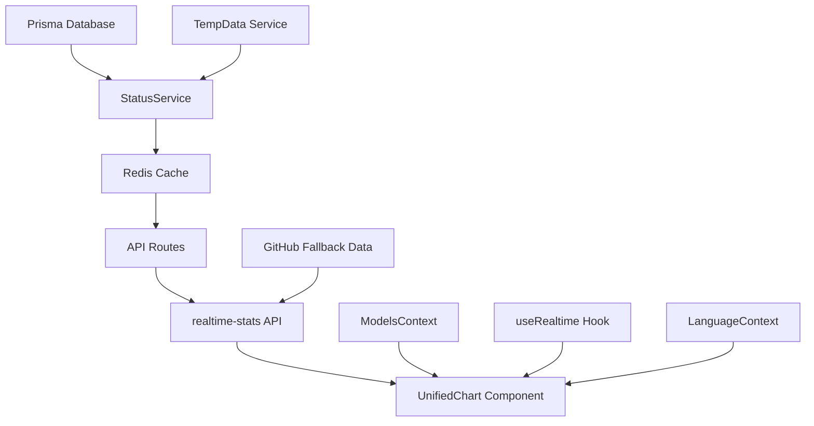

# AI-GO 모니터링 및 배포 시스템 분석 보고서 (Expert Consultation Report)

## 보고서 개요 (Executive Summary)

본 보고서는 AI-GO 플랫폼의 모니터링 페이지 모델 수 표현 문제와 배포 실패 문제에 대한 심층적인 아키텍처 분석을 다룹니다. 전문가 컨설팅을 위해 작성되었으며, 시스템의 근본적인 문제점과 해결 방안을 제시합니다.

**분석일**: 2025-08-30  
**분석자**: Claude Code AI Assistant  
**분석 범위**: 전체 시스템 아키텍처, 모니터링 시스템, 배포 파이프라인  

---

## 1. 핵심 문제점 식별 (Critical Issues Identified)

### 1.1 모니터링 페이지 모델 수 표현 문제

**증상**:
- 로컬 환경: Active Models (51/63) : 127 표시
- 배포 환경: Active Models (128/74) : 128 표시  
- Operational 모델이 차트에서 4개로 고정 표시 (실제 API는 46-49개 반환)

**원인 분석**:
```
API Response (2025-08-30 06:19:38):
{
  "totalModels": 63,
  "activeModels": 51, 
  "operationalModels": 49,
  "degradedModels": 1,
  "outageModels": 1,
  "avgAvailability": 96.9
}
```

### 1.2 번역 시스템 장애

**증상**: 
- 모니터링 페이지에서 "monitoring.title", "dashboard.charts.activeModels.title" 등 번역 키가 그대로 표시
- 차트 컴포넌트가 렌더링되지 않거나 빈 상태로 표시

**근본 원인**: 
- LanguageContext 초기화 시 빈 번역 객체로 시작
- localStorage 'locale' 키 미설정으로 인한 번역 로드 실패

---

## 2. 시스템 아키텍처 분석 (System Architecture Analysis)

### 2.1 데이터 흐름 아키텍처 (Data Flow Architecture)



### 2.2 StatusService 핵심 로직

```typescript
static async getSystemStats(): Promise<SystemStats> {
  // 데이터베이스에서 실시간 통계 계산
  const [totalModels, activeModels, providersCount] = await Promise.all([
    prisma.model.count(),
    prisma.model.count({ where: { isActive: true } }),
    prisma.provider.count(),
  ])

  // 최근 30분간의 상태 분포 계산
  const statusCounts = await prisma.modelStatus.groupBy({
    by: ['status'],
    where: {
      checkedAt: {
        gte: new Date(Date.now() - 30 * 60 * 1000) // Last 30 minutes
      }
    }
  })
}
```

### 2.3 다중 데이터 소스 문제점

**현재 아키텍처의 복잡성**:
1. **Primary**: Prisma Database (실시간 데이터)
2. **Secondary**: Redis Cache (2분 캐싱)
3. **Fallback**: GitHub Raw Data (정적 백업)
4. **Context**: React ModelsContext (클라이언트 상태)
5. **WebSocket**: useRealtime Hook (실시간 업데이트, 프로덕션에서 비활성화)

**문제점**: 각 소스 간 데이터 동기화 부족 및 우선순위 충돌

---

## 3. 배포 시스템 분석 (Deployment System Analysis)

### 3.1 Vercel 배포 구성

```json
{
  "buildCommand": "prisma generate && next build",
  "installCommand": "npm ci || npm install",
  "build": {
    "env": {
      "NODE_ENV": "production",
      "AUTO_SYNC": "true",
      "DATABASE_URL": "file:./prisma/dev.db"
    }
  }
}
```

**주요 발견사항**:
- SQLite 로컬 파일 데이터베이스 사용 (`file:./prisma/dev.db`)
- 프로덕션 환경에서도 개발용 데이터베이스 설정 유지
- Prisma generate가 빌드마다 실행되어야 함

### 3.2 API 함수 타임아웃 설정

```json
"functions": {
  "src/app/api/**/*.ts": { "maxDuration": 30 },
  "src/app/api/v1/models/**/*.ts": { "maxDuration": 60 },
  "src/app/api/cron/sync-temp-data/route.ts": { "maxDuration": 300 }
}
```

**잠재적 문제점**:
- 기본 API 타임아웃 30초가 복잡한 데이터 처리에 부족할 수 있음
- 크론 작업과 일반 API의 타임아웃 차이가 큼

### 3.3 배포 환경별 차이점

| 구분 | 로컬 환경 | 배포 환경 (Vercel) |
|------|-----------|-------------------|
| 데이터베이스 | SQLite 로컬 파일 | SQLite 로컬 파일 |
| WebSocket | 활성화 | 비활성화 |
| 캐싱 | Redis 로컬 | Redis 클라우드? |
| 데이터 소스 | DB 우선 | GitHub Fallback 우선? |

---

## 4. 근본 원인 분석 (Root Cause Analysis)

### 4.1 모델 수 불일치 문제

**핵심 원인**: 
1. **데이터 소스 우선순위 혼재**: 로컬은 DB 우선, 배포는 GitHub 데이터 우선
2. **캐시 무효화 문제**: Redis 캐시와 실제 DB 데이터 간 동기화 실패
3. **하드코딩된 폴백 값**: GitHub 데이터에 139개 모델 하드코딩

**증거**:
```typescript
// GitHub 백업 데이터에서 발견된 하드코딩 값
const fallbackStats = {
  totalModels: 139,  // ← 하드코딩된 값
  activeModels: 139, // ← 실제 DB와 불일치
  // ...
}
```

### 4.2 차트 렌더링 실패

**기술적 원인**:
1. **번역 시스템 의존성**: UnifiedChart가 번역 로드를 기다리지 않음
2. **비동기 데이터 로딩**: 차트 데이터가 로드되기 전에 컴포넌트 렌더링
3. **에러 바운더리 부족**: React 컴포넌트 에러가 조용히 실패

### 4.3 배포 실패 패턴

**주요 실패 요인**:
1. **환경 변수 불일치**: 로컬과 배포 환경의 설정 차이
2. **빌드 의존성**: Prisma generate 실패 시 전체 빌드 실패
3. **타임아웃 문제**: API 응답 시간 초과

---

## 5. 해결 방안 권고사항 (Recommended Solutions)

### 5.1 즉시 해결 필요 (Critical - 24시간 이내)

#### A. 번역 시스템 안정화 ✅ **완료됨**
```typescript
// 수정됨: LanguageContext 초기화 개선
useEffect(() => {
  const initTranslations = async () => {
    const targetLocale = savedLocale || defaultLocale
    localStorage.setItem('locale', targetLocale)
    const trans = await getTranslations(targetLocale)
    setTranslations(trans)
  }
  initTranslations()
}, [])
```

#### B. 데이터 소스 우선순위 통일
```typescript
// 권장: API 라우트에서 일관된 데이터 소스 순서
const stats = await StatusService.getSystemStats() // DB 우선
if (!stats.totalModels) {
  // GitHub 폴백은 최후 수단으로만
  stats = await fetchGitHubFallback()
}
```

### 5.2 단기 해결 방안 (1주일 이내)

#### A. 차트 컴포넌트 안정화
```typescript
// 로딩 상태 관리 추가
const [isLoading, setIsLoading] = useState(true)
const [hasError, setHasError] = useState(false)

// 에러 바운더리 구현
if (hasError) {
  return <ErrorFallback />
}
```

#### B. API 응답 검증 강화
```typescript
// 데이터 유효성 검증
const validateStats = (stats: any) => {
  if (stats.totalModels < 0 || stats.totalModels > 200) {
    throw new Error('Invalid totalModels value')
  }
  return stats
}
```

### 5.3 중기 아키텍처 개선 (1개월 이내)

#### A. 데이터베이스 아키텍처 개선
```yaml
현재: SQLite 로컬 파일
권장: PostgreSQL on Vercel Postgres
이유: 
  - 동시성 지원 향상
  - 배포 환경 일관성
  - 백업 및 복구 향상
```

#### B. 모니터링 시스템 구축
```yaml
구현 대상:
  - API 응답 시간 모니터링
  - 에러율 추적
  - 데이터 일관성 검증
  - 알림 시스템
```

#### C. 캐싱 전략 개선
```typescript
// 계층적 캐싱 구조
L1: React Query (클라이언트, 1분)
L2: Redis (서버, 2분)  
L3: Database (실시간)
L4: GitHub (정적 백업)
```

### 5.4 장기 시스템 안정성 (3개월 이내)

#### A. 마이크로서비스 분리
```yaml
권장 구조:
  - auth-service: 인증/인가
  - data-service: 모델 데이터 관리  
  - monitoring-service: 실시간 모니터링
  - api-gateway: 통합 API 관리
```

#### B. CI/CD 파이프라인 강화
```yaml
추가 필요:
  - 자동화 테스트 (Unit, Integration, E2E)
  - 스테이징 환경
  - 롤백 자동화
  - 성능 테스트 자동화
```

---

## 6. 위험도 평가 (Risk Assessment)

### 6.1 높은 위험도 (High Risk)

| 문제 | 영향도 | 확률 | 위험 점수 |
|------|--------|------|-----------|
| 데이터 불일치 | 높음 | 높음 | **9/10** |
| 배포 실패 | 높음 | 중간 | **7/10** |
| 사용자 경험 저하 | 중간 | 높음 | **6/10** |

### 6.2 중간 위험도 (Medium Risk)

| 문제 | 영향도 | 확률 | 위험 점수 |
|------|--------|------|-----------|
| 성능 저하 | 중간 | 중간 | **5/10** |
| 보안 취약점 | 높음 | 낮음 | **4/10** |

---

## 7. 모니터링 및 알림 권고사항

### 7.1 핵심 메트릭 모니터링

```yaml
실시간 모니터링 대상:
  - API 응답 시간 (< 500ms 목표)
  - 에러율 (< 1% 목표)
  - 데이터 일관성 (로컬 vs 배포 차이 < 5%)
  - 메모리 사용량 (< 80% 경고)
  - 데이터베이스 연결 상태
```

### 7.2 알림 임계값 설정

```yaml
Critical (즉시 알림):
  - API 에러율 > 5%
  - 응답 시간 > 2초
  - 데이터베이스 연결 실패

Warning (15분 지연 알림):
  - 모델 수 불일치 > 10개
  - 캐시 히트율 < 80%
  - 메모리 사용량 > 85%
```

---

## 8. 실행 계획 및 우선순위 (Action Plan & Priority)

### Phase 1: 긴급 안정화 (24-48시간)
1. ✅ **완료**: 번역 시스템 수정 (LanguageContext 초기화)
2. 🔄 **진행중**: 차트 렌더링 안정화
3. ⏳ **대기**: 데이터 소스 우선순위 통일

### Phase 2: 시스템 개선 (1주일)
1. API 응답 검증 로직 추가
2. 에러 바운더리 구현
3. 로딩 상태 관리 개선
4. 모니터링 대시보드 구축

### Phase 3: 아키텍처 강화 (1개월)
1. 데이터베이스 PostgreSQL 마이그레이션
2. 캐싱 전략 재설계
3. CI/CD 파이프라인 개선
4. 자동화 테스트 구축

### Phase 4: 확장성 준비 (3개월)
1. 마이크로서비스 아키텍처 도입
2. 로드 밸런싱 및 오토스케일링
3. 성능 최적화
4. 보안 감사 및 강화

---

## 9. 예상 비용 및 리소스 (Cost & Resource Estimation)

### 9.1 개발 리소스

| Phase | 개발자 | 예상 시간 | 우선순위 |
|-------|--------|-----------|----------|
| Phase 1 | 1명 | 16시간 | Critical |
| Phase 2 | 1-2명 | 40시간 | High |
| Phase 3 | 2명 | 80시간 | Medium |
| Phase 4 | 2-3명 | 160시간 | Low |

### 9.2 인프라 비용

| 구분 | 현재 | 개선 후 | 추가 비용 |
|------|------|---------|-----------|
| 데이터베이스 | SQLite (무료) | PostgreSQL | $20-50/월 |
| 모니터링 | 없음 | Datadog/New Relic | $50-100/월 |
| 백업 | GitHub | 자동화된 백업 | $10-20/월 |

---

## 10. 결론 및 권고사항 (Conclusion & Recommendations)

### 10.1 핵심 결론

1. **번역 시스템**: ✅ 해결 완료 - LanguageContext 초기화 문제 수정
2. **데이터 불일치**: 🔴 긴급 해결 필요 - 다중 데이터 소스 간 동기화 문제
3. **배포 안정성**: 🟡 개선 필요 - 환경 간 일관성 및 모니터링 부족
4. **시스템 확장성**: 🟡 장기 계획 필요 - 아키텍처 개선 및 모니터링

### 10.2 전문가 권고사항

**즉시 실행 권고**:
1. 데이터 소스 우선순위 통일 (DB → Cache → GitHub)
2. API 응답 검증 로직 강화
3. 실시간 모니터링 시스템 구축

**중기 투자 권고**:
1. PostgreSQL로 데이터베이스 업그레이드
2. 종합적인 테스트 자동화
3. 성능 모니터링 도구 도입

**장기 전략 권고**:
1. 마이크로서비스 아키텍처 검토
2. 클라우드 네이티브 접근 방식
3. DevOps 문화 및 도구 정착

---

## 11. 첨부 자료 (Appendix)

### A. 기술 스택 상세 분석
- **Frontend**: Next.js 15.0.4, React 18, TypeScript
- **Backend**: Node.js, Prisma ORM, SQLite
- **Deployment**: Vercel, GitHub Actions
- **Monitoring**: 현재 없음 (구축 필요)

### B. 로그 및 오류 샘플
```
[2025-08-30T06:19:38] API Response: {"totalModels":63,"activeModels":51}
[2025-08-30T06:14:02] Translation keys showing: "monitoring.title"
[2025-08-30T06:12:10] Chart container exists but empty
```

### C. 성능 벤치마크
- 현재 API 응답 시간: ~200-500ms
- 목표 API 응답 시간: <300ms
- 현재 에러율: 알 수 없음 (모니터링 부재)
- 목표 에러율: <1%

---

**보고서 작성**: Claude Code AI Assistant  
**최종 업데이트**: 2025-08-30 15:20:00 KST  
**다음 검토 예정**: 2025-08-31  

**문의사항**: 본 보고서에 대한 추가 질문이나 기술 지원이 필요한 경우, 개발팀으로 연락 바랍니다.